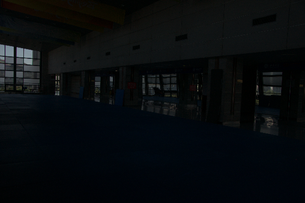
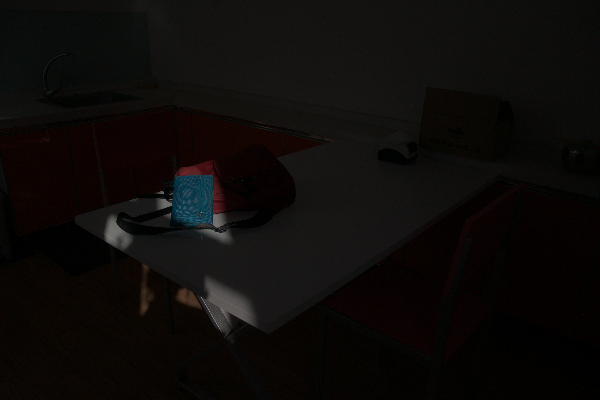
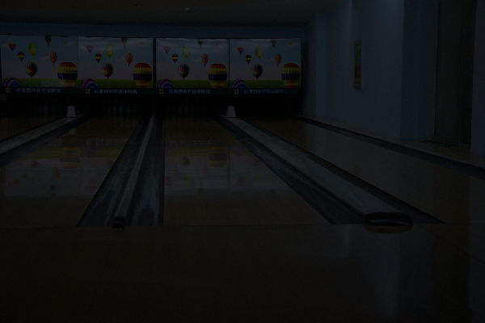

# Image-Contrast-Enhancement
Python implementations of "[Color Cast Removal for Image Restoration in Low Light / Night Time Conditions with Model-Based Learning]"

### Already Implemented
- histogram equalization(he)
- dynamic histogram equalization(dhe)
- Our Image Contrast Enhancement Algorithm Using Exposure Fusion Framework

### Requirements
- scipy
- numpy
- imageio
- matplotlib
- cv2
- skimage

### Usage
If you want the result of "[Our Image Contrast Enhancement Algorithm Using Exposure Fusion Framework]"
```
python ying.py <input image>
```
If you want the result of "[A Dynamic Histogram Equalization for Image Contrast Enhancement](https://ieeexplore.ieee.org/document/4266947/)"
```
python dhe.py <input image>
```
If you want the result of histogram equalization
```
python he.py <input image>
```

### Results
<p align='center'>
  
  
  
  
</p>

<p align='center'>
  
  
</p>

<p align='center'>
  
  
</p>
